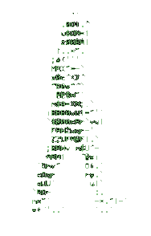

<h1 align="center">
     
<samp>&gt; Hey There!
<b> I'm <a target="_blank" href="https://shahriarshafin.github.io/">IGOR </a>&lt;</b>
</samp>
        
</h1>

&nbsp;

 
<h3 align="center"><samp><b>A guy passionate about computers and technologies 💻</b></samp></h3> <h2 align="center"><b>&lt/&gt</b></h2>.   For now, just a  <strong>Software Development Technician</strong> who found their way into the field of programming. Currently, <strong>I'm Studying Back-End and researching Cybersecurity</strong> as a hobby, but I also have some skills in Front-End like HTML, CSS, WordPress (Elementor Plugin), a bit of JS and PHP, and some other languages like Java, Native Java (Android), some databases like SQL and MongoDB.

##   

        

 

 
 &nbsp;
 &nbsp;

## My Skills

#### Main Stack:

&nbsp;
&nbsp;
&nbsp;
&nbsp;

#### Workstation Tools:

&nbsp;

&nbsp;
&nbsp;

## Contacts:

 

 

&nbsp;&nbsp;
 

